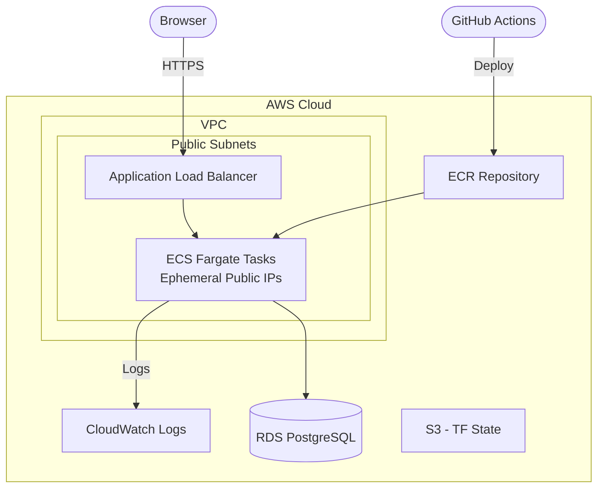
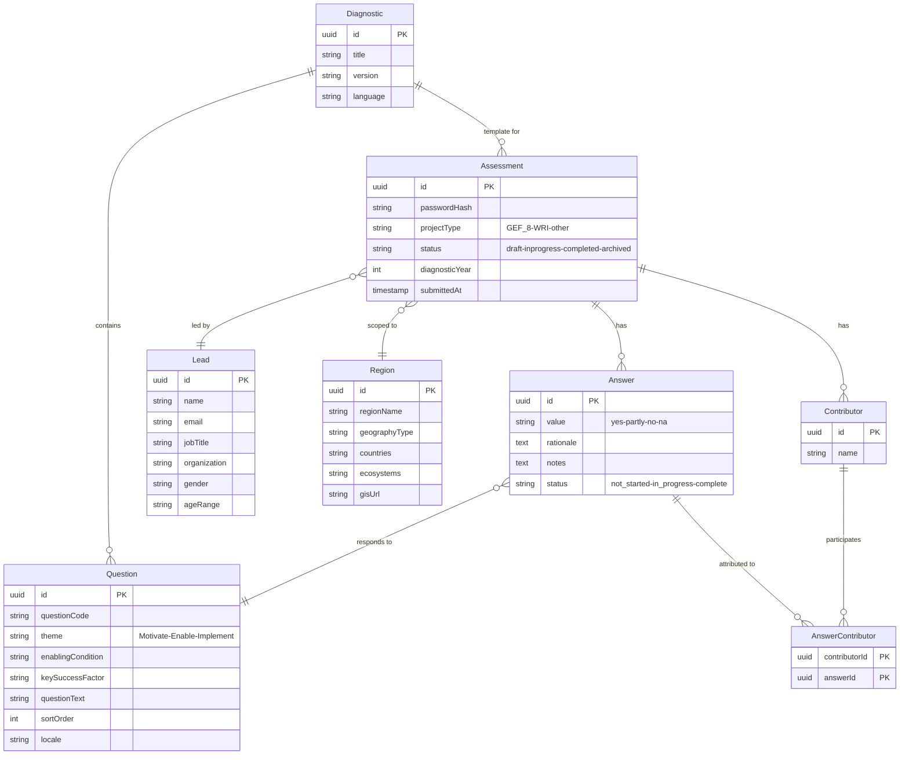

# Restoration Diagnostic Web Application

A production-ready Next.js 15 application for landscape restoration assessments featuring multi-language support (EN/ES/FR/PT), interactive maps, rich text editing, and XLSX export — backed by TypeORM + PostgreSQL and deployed to AWS ECS Fargate via Terraform and GitHub Actions.

## 🏗️ Architecture



## 🧰 Tech Stack

| Layer | Technology |
|-------|-----------|
| Framework | Next.js 15 (App Router), React 19 |
| UI | [WRI Design System](https://github.com/wri/wri-design-systems), Chakra UI v3, Tailwind CSS, TipTap Rich Text Editor |
| Forms | React Hook Form |
| Database | PostgreSQL 17, TypeORM 0.3 |
| Auth | Bcrypt password hashing, session tokens (Web Crypto API) |
| i18n | 4 languages (EN, ES, FR, PT) with JSON translation files |
| Maps | Interactive map components with layer/legend controls |
| Export | XLSX assessment export |
| Analytics | Google Tag Manager, Hotjar |
| Deployment | AWS ECS Fargate, ALB, ECR, Terraform |
| CI/CD | GitHub Actions (QA, Production, PR checks) |
| Testing | Jest, React Testing Library |

## 📁 Project Structure

```
.
├── .github/
│   └── workflows/
│       ├── deploy-qa.yml              # QA deployment workflow
│       ├── deploy-production.yml      # Production deployment workflow
│       ├── pr-check.yml               # Pull request validation
│       └── destroy.yml                # Infrastructure teardown
├── src/
│   ├── app/                           # Next.js App Router
│   │   ├── api/
│   │   │   ├── health/               # Health check endpoint
│   │   │   └── assessments/           # Assessment REST API
│   │   │       ├── route.ts           #   POST create assessment
│   │   │       └── [id]/
│   │   │           ├── answers/       #   GET/POST answers
│   │   │           ├── contributors/  #   GET/POST/DELETE contributors
│   │   │           ├── export-responses/ # XLSX export
│   │   │           ├── login/         #   Password authentication
│   │   │           ├── preparation/   #   Preparation workflow
│   │   │           └── questions/     #   GET questions by language
│   │   ├── assessment/
│   │   │   ├── setup/                 # Assessment setup form
│   │   │   └── [id]/
│   │   │       ├── page.tsx           # Overview & password prompt
│   │   │       ├── created/           # Success page
│   │   │       ├── preparation/       # Multi-step preparation
│   │   │       │   └── [step]/
│   │   │       └── [theme]/           # Theme pages (Motivate/Enable/Implement)
│   │   ├── auth/                      # Sign-in & sign-up pages
│   │   └── welcome/                   # Welcome page
│   ├── components/
│   │   ├── assessment/                # Assessment UI components
│   │   │   ├── DiagnosticPreparation/ #   Multi-step preparation form
│   │   │   ├── Overview/              #   Assessment overview & export
│   │   │   ├── AnswerOptions.tsx      #   Yes/Partly/No/NA selection
│   │   │   ├── ChakraRichTextEditor.tsx # Rich text editor
│   │   │   ├── ContributorsCombobox.tsx # Team member selection
│   │   │   ├── FollowUpQuestions.tsx   #   Dynamic follow-ups
│   │   │   └── PasswordPrompt.tsx     #   Access control
│   │   ├── Map/                       # Interactive map with layers & legends
│   │   ├── static/landing/            # Landing page sections
│   │   ├── icons/                     # 50+ custom SVG icons
│   │   ├── Footer/
│   │   ├── Providers/                 # Chakra UI & language context
│   │   └── ui/                        # Shared UI (DatePicker, RichText, Loader)
│   ├── db/                            # Database layer
│   │   ├── schema.dbml                # Database schema (source of truth)
│   │   ├── data-source.ts             # TypeORM configuration
│   │   ├── entities/                  # 8 TypeORM entities
│   │   │   ├── Assessment.entity.ts   #   Assessment instance
│   │   │   ├── Answer.entity.ts       #   Answer (yes/partly/no/na)
│   │   │   ├── AnswerContributor.entity.ts # Junction table
│   │   │   ├── Contributor.entity.ts  #   Team members
│   │   │   ├── Diagnostic.entity.ts   #   Assessment template
│   │   │   ├── Lead.entity.ts         #   Assessment lead (demographics)
│   │   │   ├── Question.entity.ts     #   Questions (3 themes)
│   │   │   └── Region.entity.ts       #   Geography & GIS
│   │   ├── migrations/                # 15+ database migrations
│   │   ├── seeds/                     # Diagnostic & question seeds
│   │   ├── queries/                   # Complex assessment queries
│   │   └── scripts/                   # DB utility scripts
│   ├── i18n/                          # Internationalization
│   │   ├── translations/              # EN, ES, FR, PT JSON files
│   │   └── scripts/                   # Import/export/validate scripts
│   ├── hooks/                         # Custom React hooks
│   │   ├── useAutoSave.ts             #   Auto-save answers
│   │   ├── useAssessmentSetupForm.ts  #   Setup form logic
│   │   ├── useRichTextEditor.ts       #   Editor state
│   │   └── useResponsiveFlags.ts      #   Responsive helpers
│   ├── contexts/                      # React contexts
│   │   └── LanguageContext.tsx         #   Global language state
│   ├── constants/                     # App constants & options
│   ├── types/                         # TypeScript type definitions
│   ├── utils/                         # Utilities (session, rate-limiter, xlsx)
│   └── middleware.ts                  # Auth middleware for protected routes
├── terraform/
│   ├── backend-setup/                 # Terraform state backend (S3 + DynamoDB)
│   ├── infrastructure/                # VPC, ALB, ECS, ECR, Security Groups
│   └── environments/                  # QA & production tfvars
├── docs/resources/                    # CSV question sources & schema reference
├── Dockerfile                         # Multi-stage build (standalone Next.js)
├── docker-compose.yml                 # Local PostgreSQL for development
└── package.json
```

## 🗄️ Database Schema



## 🔌 API Endpoints

| Method | Endpoint | Description |
|--------|----------|-------------|
| `GET` | `/api/health` | Health check |
| `POST` | `/api/assessments` | Create assessment (returns ID + password) |
| `GET` | `/api/assessments/[id]/questions` | Get questions by language |
| `GET` | `/api/assessments/[id]/answers` | List all answers |
| `POST` | `/api/assessments/[id]/answers` | Create answers |
| `GET` | `/api/assessments/[id]/contributors` | List contributors |
| `POST` | `/api/assessments/[id]/contributors` | Add contributor |
| `DELETE` | `/api/assessments/[id]/contributors` | Remove contributor |
| `POST` | `/api/assessments/[id]/login` | Verify password & create session |
| `GET` | `/api/assessments/[id]/preparation` | Get preparation status |
| `POST` | `/api/assessments/[id]/preparation` | Save preparation data |
| `GET` | `/api/assessments/[id]/export-responses` | Export assessment to XLSX |

## 🌐 Internationalization (i18n)

Four languages are supported with both UI and question translations:

| Language | Code | UI File | Questions File |
|----------|------|---------|---------------|
| English | `en` | `en.json` | `questions-en.json` |
| Spanish | `es` | `es.json` | `questions-es.json` |
| French | `fr` | `fr.json` | `questions-fr.json` |
| Portuguese | `pt` | `pt.json` | `questions-pt.json` |

Translation files are in `src/i18n/translations/`. Management scripts:

```bash
npm run i18n:import-csv          # Import questions from CSV
npm run i18n:export-questions     # Export questions to JSON
npm run i18n:import-questions     # Import questions from JSON
npm run i18n:validate            # Validate translation completeness
npm run i18n:cleanup             # Remove duplicate questions
```

## 🚀 Getting Started

### Prerequisites

- [Node.js](https://nodejs.org/) 20.x (see `.nvmrc`)
- [Docker](https://www.docker.com/)
- [Terraform](https://www.terraform.io/) 1.0+ (for AWS deployment)
- [AWS CLI](https://aws.amazon.com/cli/) configured with appropriate credentials
- [GitHub](https://github.com/) account

### 1. Clone and Install Dependencies

```bash
git clone <repository-url>
cd gri-restoration-diagnostic

# Use correct Node.js version
nvm use

# Install dependencies
npm install
```

### 2. Database Setup (AWS RDS)

The application uses a shared AWS RDS PostgreSQL instance (`rd-app-db2`) across all environments. Each environment (dev, qa, production) has its own database within the same RDS instance.  Access to the DB instance is controlled by an AWS security group (`rd-app-db1-sg`), and each environment has access to it.  Folks trying to connect to the DB directly need to add their external IP address to the [AWS security group](https://us-east-1.console.aws.amazon.com/ec2/home?region=us-east-1#SecurityGroup:groupId=sg-09c5bc29f068fa9b7).

#### Security Group Configuration

The RDS instance is publicly accessible to support local development. You must add your external IP to the [AWS security group](https://us-east-1.console.aws.amazon.com/ec2/home?region=us-east-1#SecurityGroup:groupId=sg-09c5bc29f068fa9b7).

1. Add inbound rule:
   - **Type:** PostgreSQL
   - **Port:** 5432
   - **Source:** `<your-ip-address>/32`
   - **Description:** "[Your Name]"

#### Configure Environment Variables

```bash
# Copy example environment file
cp .env.example .env
```

Update `.env` with RDS credentials:

```env
# Database Configuration (AWS RDS)
DB_HOST=rd-app-db2.c9o0i0gg61en.us-east-1.rds.amazonaws.com
DB_PORT=5432
DB_USER=rduser
DB_PASSWORD=<get-from-aws-parameter-store>
DB_NAME=dev  # or 'qa', 'production'

# TypeORM Configuration
TYPEORM_SYNCHRONIZE=false
TYPEORM_LOGGING=true

# Application
NODE_ENV=development

# SSL Configuration (enable for production)
DATABASE_SSL_REJECT_UNAUTHORIZED=false
```

**Getting Database Credentials:**
- Master password is stored in [AWS Systems Manager Parameter Store](https://console.aws.amazon.com/systems-manager/parameters)
- Navigate to Parameter Store and search for `rd-app-db2`

**Get your external IP:**
```bash
curl ifconfig.me
```

#### Run Database Migrations

```bash
# Run migrations to create tables
npm run migration:run

# Seed initial diagnostic questions (24 questions)
npm run seed:run
```

**Generate migrations when schema changes:**
```bash
npm run migration:generate
```

#### Verify Database Setup

```bash
# Connect to dev database
psql -h rd-app-db2.c9o0i0gg61en.us-east-1.rds.amazonaws.com -U postgres -d dev

# List tables
\dt

# View diagnostic seed data
SELECT id, version, language FROM diagnostic;

# Exit
\q
```

**Note:** If connection times out, verify your IP is in the `rd-app-db1-sg` security group.

### 3. Set Up Terraform State Backend

Before deploying infrastructure, you need to create the S3 bucket and DynamoDB table for Terraform state:

```bash
cd terraform/backend-setup

# Make the script executable
chmod +x setup.sh

# Run setup (uses default values)
./setup.sh

# Or customize with environment variables
AWS_REGION=us-east-1 PROJECT_NAME=rd-app ./setup.sh
```

### 4. Configure GitHub Repository

1. Create a new GitHub repository
2. Push this code to the repository
3. Create the following branches:
   - `main` or `production` - Production deployments
   - `qa` - QA deployments

4. Add GitHub variables for AWS permissions (Settings → Secrets and variables → Actions -> Variables):
   - `OIDC_ROLE` - ARN from AWS console for role GitHubActionsOIDC

### 5. Required AWS IAM Permissions

The AWS credentials need permissions for:
- ECR (create/push images)
- ECS (manage clusters, services, tasks)
- EC2 (VPC, subnets, security groups)
- ELB (Application Load Balancers)
- IAM (create roles and policies)
- CloudWatch (logs)
- S3 (Terraform state)
- DynamoDB (Terraform locks)

### 6. Deploy

Push to the appropriate branch to trigger deployment:

```bash
# Deploy to QA
git checkout -b qa
git push origin qa

# Deploy to Production
git checkout main
git push origin main
```

## 🔧 Local Development

```bash
# Run development server
npm run dev

# Run tests
npm test

# Run tests with coverage (CI mode)
npm run test:ci

# Lint
npm run lint

# Build for production
npm run build

# Start production server
npm start
```

### Database Management Commands

**Migrations:**
```bash
# Generate new migration (after entity changes)
npm run migration:generate

# Run pending migrations
npm run migration:run

# Revert last migration
npm run migration:revert
```

**Seeding:**
```bash
# Run seed data
npm run seed:run
```

**Direct Database Access:**
```bash
# Connect to dev database
psql -h rd-app-db2.c9o0i0gg61en.us-east-1.rds.amazonaws.com -U postgres -d dev

# Connect to QA database
psql -h rd-app-db2.c9o0i0gg61en.us-east-1.rds.amazonaws.com -U postgres -d qa

# Connect to production database
psql -h rd-app-db2.c9o0i0gg61en.us-east-1.rds.amazonaws.com -U postgres -d production
```

**⚠️ Legacy Docker Commands (Deprecated):**
```bash
# These commands are no longer used (RDS replaced local Docker)
# npm run db:start
# npm run db:stop
# npm run db:reset
```

### Docker Build

```bash
# Build image
docker build -t rd-app .

# Run container
docker run -p 3000:3000 rd-app
```

## 📋 Environment Configuration

### Database (Shared RDS Instance)
- **RDS Endpoint:** `rd-app-db2.c9o0i0gg61en.us-east-1.rds.amazonaws.com`
- **Engine:** PostgreSQL 17
- **Databases:**
  - `dev` - Development database
  - `qa` - QA database
  - `production` - Production database
- **Access:** Publicly accessible with security group IP allowlist
- **Credentials:** Stored in AWS Systems Manager Parameter Store

### QA Environment
- VPC CIDR: `10.0.0.0/16`
- Database: `qa`
- Resources: 256 CPU / 512 MB Memory
- Desired count: 1 task
- Auto-scaling: 1-2 tasks

### Production Environment
- VPC CIDR: `10.1.0.0/16`
- Database: `production`
- Resources: 512 CPU / 1024 MB Memory
- Desired count: 2 tasks
- Auto-scaling: 2-10 tasks

## 🔄 CI/CD Workflows

| Workflow | Trigger | Description |
|----------|---------|-------------|
| `deploy-qa.yml` | Push to `qa` branch | Deploy to QA environment |
| `deploy-production.yml` | Push to `main`/`production` | Deploy to Production |
| `pr-check.yml` | Pull requests | Run tests and validate |
| `destroy.yml` | Manual | Tear down infrastructure |

## 🗑️ Teardown

### Destroy Infrastructure (via GitHub Actions)

1. Go to Actions → Destroy Infrastructure
2. Select the environment (qa or production)
3. Type `DESTROY` to confirm
4. Run workflow

### Destroy Terraform State Backend

```bash
cd terraform/backend-setup
chmod +x teardown.sh
./teardown.sh
```

⚠️ **Warning**: This will permanently delete all Terraform state files!

## 📊 Monitoring

- **CloudWatch Logs**: `/ecs/rd-app-{environment}`
- **Container Insights**: Enabled on ECS cluster
- **Health Check**: `GET /api/health`

## 🔐 Security Features

- VPC with public subnets; exposure limited via security groups and ALB
- ECS Fargate tasks with ephemeral public IPs (no NAT Gateway)
- Security groups limiting traffic
- S3 bucket versioning and encryption for Terraform state
- ECR image scanning on push
- Non-root container user
- HTTPS headers configured in Next.js
- Bcrypt password hashing for assessment access
- Session token authentication (Web Crypto API, Edge Runtime)
- Rate limiting on API endpoints
- Auth middleware protecting assessment routes
- AWS RDS SSL connections (CA bundle in Docker image)

## 💰 Cost Optimization

- Use `FARGATE_SPOT` for non-production workloads
- Auto-scaling based on CPU/Memory utilization
- ECR lifecycle policies to clean old images
- No NAT Gateway — ECS tasks use ephemeral public IPs

## 📝 Customization

### Adding Environment Variables

1. Update `terraform/environments/{env}.tfvars`:
```hcl
app_environment_variables = {
  "MY_VAR" = "my-value"
}
```

2. Redeploy

### Changing Resources

Edit `terraform/environments/{env}.tfvars`:
```hcl
container_cpu    = 512   # 0.5 vCPU
container_memory = 1024  # 1 GB
desired_count    = 3
```

## 🆘 Troubleshooting

### Common Issues

1. **Database connection fails**
   - Verify your IP is in the `rd-app-db1-sg` security group allowlist
   - Check `.env` has correct RDS credentials from Parameter Store
   - Test connection: `psql -h rd-app-db2.c9o0i0gg61en.us-east-1.rds.amazonaws.com -U postgres -d dev`
   - Verify RDS instance is running in AWS Console

2. **Connection timeout to RDS**
   - Add your external IP to security group: `curl ifconfig.me`
   - Check VPN/firewall settings aren't blocking port 5432
   - Verify you're using the correct database name (dev/qa/production)

3. **Migration generation fails**
   - Ensure entities are properly imported in `data-source.ts`
   - Verify TypeORM can connect to RDS (check credentials)
   - Check entity decorators and column types
   - Review `tsconfig.typeorm.json` for CommonJS compatibility

4. **Deployment fails at ECS service stability**
   - Check CloudWatch logs
   - Verify health check endpoint returns 200
   - Check security group rules
   - Ensure ECS tasks can connect to RDS

5. **Terraform state lock error**
   - Wait for other deployments to complete
   - If stuck, manually release lock in DynamoDB

6. **Docker build fails**
   - Ensure all dependencies are in package.json
   - Check for missing files in .dockerignore

## 📄 License

MIT
